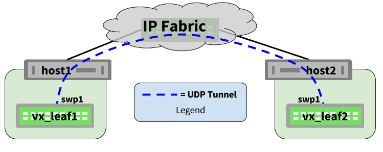
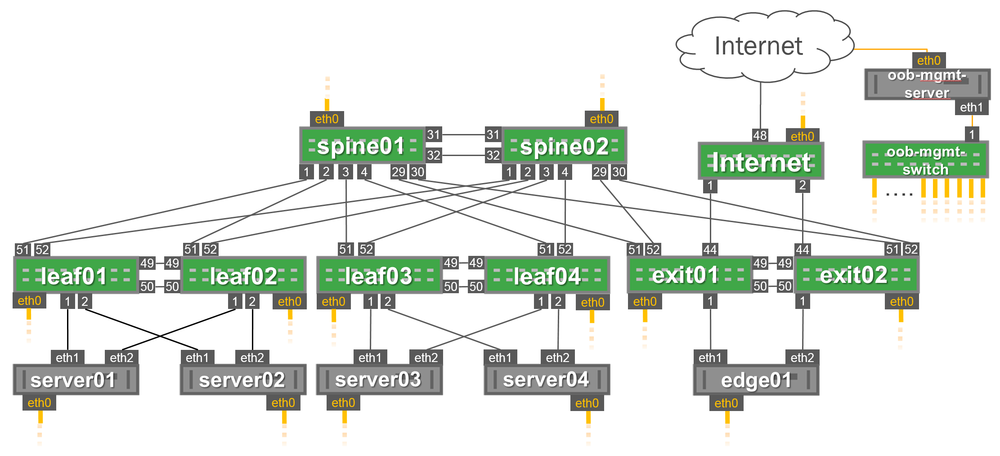
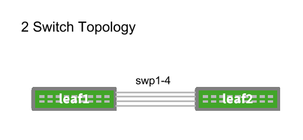
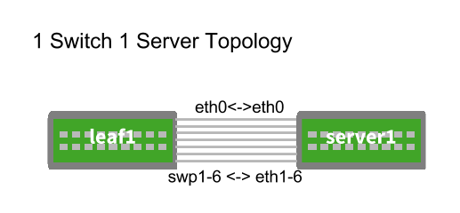
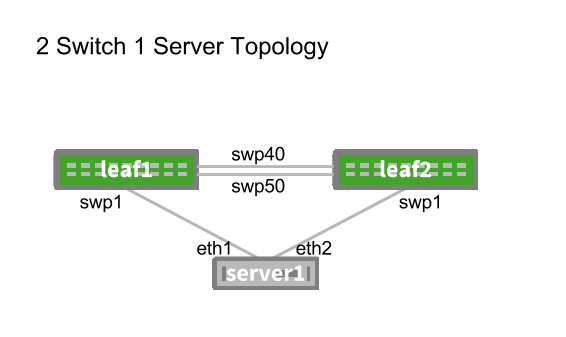
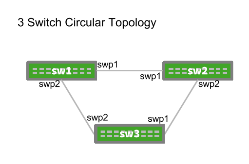
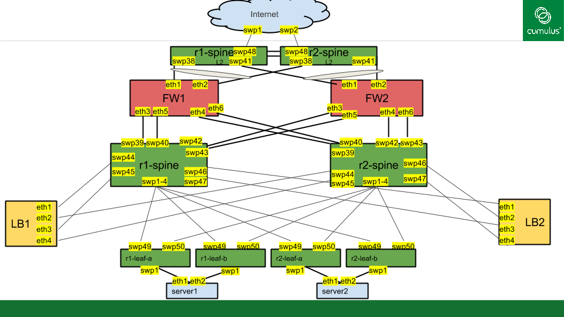

# Topology Converter Documentation

## Table of Contents
* [Glossary](#glossary)
* [Features](#features)
* [Installation](#installation)
* [Using Topology Converter](#using-topology-converter)
  * [The Basic Workflow](#the-basic-workflow)
  * [What is it doing?](#what-is-happening-when-you-run-topology-converter)
  * [Functional Defaults](#functional-defaults)
* [Vagrant Box Selection](#vagrant-box-selection)
* [Supported Attributes](#supported-attributes)
* [Optional Features](#optional-features)
  * [Providers](#providers)
  * [Faked Devices](#faked-devices)
  * [Boot Ordering](#boot-ordering)
  * [MAC Address Handout](#mac-handout)
  * [Ansible Hostfile Generation](#ansible-hostfile-generation)
  * [Inter-Hypervisor Simulation](#inter-hypervisor-simulation)
  * [Custom Templates](#custom-templates)
  * [Passthrough Attributes](#passthrough-attributes)
  * [Provisioning Scripts](#provisioning-scripts)
  * [Specifying an Ansible Playbook](#ansible-playbooks)
  * [Automatically Building A Management Network](#automatically-building-a-management-network)
  * [PXE Booting Hosts](#pxe-booting-hosts)
  * [Debugging Mode](#debugging-mode)
* [Miscellaneous Info](#miscellaneous-info)
* [Example Topologies](#example-topologies)
  * [The Reference Topology](#the-reference-topology)
  * [2 Switch](#2-switch-topology)
  * [1 Switch 1 Server](#1-switch-1-server-topology)
  * [2 Switch 1 Server](#2-switch-1-server-topology)
  * [3 Switch Circular](#3-switch-circular-topology)


```
                                                                       +---------+
                                                                  +--> | LibVirt |
                    +----------------------+                      |    +---------+
+--------------+    |                      |    +--------------+  |
| Topology.dot +--> |  Topology-Converter  +--> | Vagrantfile  +--+
+--------------+    |                      |    +--------------+  |
                    +----------------------+                      |    +------------+
                                                                  +--> | VirtualBox |
                                                                       +------------+
```

## Glossary:
### Topology File
Usually a file ending in the ".dot" suffix. This file describes the network topology link-by-link. Written in https://en.wikipedia.org/wiki/DOT_(graph_description_language). This file can be the same one used as part of the [Perscriptive Topology Manager (PTM) feature](https://docs.cumulusnetworks.com/display/DOCS/Prescriptive+Topology+Manager+-+PTM) in Cumulus Linux.
### Provider
Similar to a hypervisor, providers are Vagrant's term for the device that is either directoy hosting the VM (virtualbox) or the subsystem that vagrant is communicating with to further orchestratrate the creation of the VM (libvirt)
### Interface Remapping
Interface remapping is the process by which interfaces are renamed to match the interfaces specified in the topology file. Interface Remapping uses UDEV rules that are orchestrated in the Vagrantfile and applied by rebooting the machines under simulation. This process allows a device in a topologyfile to simulate ports like "swp49" without having to simulate ports swp1-48. See the "[Miscellaneous Info](#miscellaneous-info)" Section for additional information.


## Features
* Converts a topology file "topology.dot" into a Vagrantfile
* 1 file is modified by the user (topology.dot) to create a suitable Vagrantfile
* Handles interface remapping on Vx instances (and hosts) to match the interfaces used in the provided topology file
* Removes extra Ruby-based logic from the Vagrantfile making a simple human-readable output
* Can generate Vagrantfiles that contain servers and switches and anything else that can be found in a Vagrant Box image
* Does not require Vagrant/Virtualbox/libvirt to be installed to create the Vagrantfile
* Supports the Virtualbox and Libvirt Vagrant Providers (Hypervisors)

## Installation

### Ubuntu
Both 16.04 and 14.04.

```
sudo apt install python-pip
sudo pip install --upgrade pip
sudo pip install setuptools
sudo pip install pydotplus
sudo pip install jinja2
sudo pip install ipaddress
```

### Mac


```
sudo easy_install pip
sudo pip install --upgrade pip
sudo pip install setuptools
sudo pip install pydotplus
sudo pip install jinja2
sudo pip install ipaddress
```


## Using Topology Converter
To use Topology Converter [TC] you need to work with one file: topology.dot

The actual name of the topology file is irrelevant. Your "topology.dot" file could be named "HAPPYHAPPYJOYJOY.dot" and that would be just fine.

### The Basic Workflow
**1). Create a Topology File**
Create a topology.dot file or borrow a provided ".dot" file from the "topology_converter/examples/" directory
In this example, we'll work with the topology_converter / examples / 2switch_1server.dot file shown below:

```
graph dc1 {
 "leaf1" [function="leaf" os="CumulusCommunity/cumulus-vx" memory="512" config="./helper_scripts/extra_switch_config.sh"]
 "leaf2" [function="leaf" os="CumulusCommunity/cumulus-vx" memory="512" config="./helper_scripts/extra_switch_config.sh"]
 "server1" [function="host" os="boxcutter/ubuntu1404" memory="512" config="./helper_scripts/extra_server_config.sh"]
   "leaf1":"swp40" -- "leaf2":"swp40"
   "leaf1":"swp50" -- "leaf2":"swp50"
   "server1":"eth1" -- "leaf1":"swp1"
   "server1":"eth2" -- "leaf2":"swp1"
}
```

Place this topology.dot file in the same directory as topology_converter.py (or any subdirectory beneath the directory which contains topology_converter.py)

**2). Convert it to a Vagrantfile**

```
      $ python ./topology_converter.py ./topology.dot
```

or if using Libvirt:


```
      $ python ./topology_converter.py ./topology.dot -p libvirt
```

**3). Start the Simulation**

```
      $ vagrant up
```

or if using Libvirt:


```
      $ vagrant up --provider=libvirt
```

### What is happening when you run Topology Converter?
1. When topology_converter (TC) is called, TC reads the provided topology file line by line and learns information about each node and each link in the topology.
2. This information is stored in a variables datastructure. (View this datastructure using the "python ./topology_converter.py [topology_file] -dd" option)
3. A jinja2 template "Vagrantfile.j2" (stored in the /templates directory) is used to render a Vagrantfile based on the variables datastructure.

### Functional Defaults
Functional defaults provide basic options for memory and OS when using pre-defined functions. Presently the functional defaults are defined as follows but can be overwritten by manually specifying the associated attribute.

**For Functions:** "oob-switch" "exit" "superspine" "spine" "leaf" "tor"

**Functional Defaults are:**
* os="CumulusCommunity/cumulus-vx"
* memory="512"

**For Functions:** "oob-server" and "host"

**Functional Defaults are:**
* os="yk0/ubuntu-xenial"
* memory="512"

Note: See more information about what functions are used for in the [Faked Devices](#faked-devices) and [Boot Ordering](#boot-ordering) sections.

### Vagrant Box Selection
There are a number of different sources of Vagrant box images however there are several that we consistently use in simulations. Here is a list of those commonly used images.

For Virtualbox:
* cumuluscommunity/cumulus-vx
* yk0/ubuntu-xenial
* ubuntu/xenial64
* boxcutter/ubuntu1404
* boxcutter/ubuntu1604
* boxcutter/fedora23
* debian/jessie64

For Libvirt:
* cumuluscommunity/cumulus-vx
* **Mutated** boxcutter/ubuntu1404
* debian/jessie64
* yk0/ubuntu-xenial

*Note: When using Ubuntu1604 with the libvirt provider, an image that was natively built for libvirt must be used like yk0/ubuntu-xenial otherwise the machine will fail to boot. See https://github.com/vagrant-libvirt/vagrant-libvirt/issues/607 , https://github.com/vagrant-libvirt/vagrant-libvirt/issues/609

*Note: Mutation is the process of converting an image which was written for use with one hypervisor to run under another hypervisor, to learn how to mutate a box that was built for the virtualbox provider to use the libvirt provider check out this [community post](https://community.cumulusnetworks.com/cumulus/topics/converting-cumulus-vx-virtualbox-vagrant-box-gt-libvirt-vagrant-box).

### Supported Attributes
Note: This list cannot be exhaustive because users can define new [passthrough attributes](#passthrough-attributes) and use them with custom templates. These are simply the attributes that the default template (Vagrantfile.j2) has support for.

#### Node(Device) Level Attributes
* os -- Sets the Operating System (i.e. the vagrant box) to be booted. This can also be provided indirectly when using a "function" as discussed in the [Functional Defaults](#functional-defaults) section or in the "function" attribute below.
* config -- This defines a provisioning script to be called on the VM during the initial boot process. This script applies a basic interface configuration so the machine will be able to be controlled by vagrant after the interface remap. This can be overloaded with whatever additional configuration you may want your devices to have but keep in mind this script will be executed prior to having [interfaces remapped](#interface-remapping) so any configuration that requires the presence of particular interfaces (like running "ifreload -a") will not be able to complete here.
* memory -- (mostly optional) Sets the amount of memory (in MB) to be provided to the VM.
* version -- (optional) Sets the version of the vagrant box to be used.
* function -- (optional) Correspondes to the [boot order](#boot-ordering) and the [functional defaults](#functional-defaults) in use for the VM. This can specify other attributes like OS and Memory.
* playbook -- (optional) Defines the provisioning playbook to be run on the device. Keep in mind this playbook may be executed prior to having [interfaces remapped](#interface-remapping).
* tunnelip -- (optional) Defines the IP address to be used as a source address for UDP tunnel building in libvirt.
* pxehost -- (optional) Defines the VM as requiring PXEboot, sets the Network as a boot target alongside the Harddrive of the VM.
* remap -- (optional) Can be set to False to avoid all udev based remapping operations. For use with other boxes that are not linux based etc.
* ubuntu -- (optional -- deprecated in v4.3.0) Used to identify ubuntu14.04 boxes in order to apply special configuration to the /etc/failsafe.conf file to expediate reboots.
* mgmt_ip -- (optional) Used with the [Automated Management Network](./auto_mgmt_network) feature.
* ports -- (optional) (_libvirt only_) Used to specify a range of ports that should exist on the node in question. This option only works for devices in functional groups: oob-switch, exit,superspine,spine,leaf,ToR. Example: ports=32 would make sure that swp1-swp32 exist on the target device. This option does not support breakout ports at this time.
* ssh_port -- (optional) Specify a port (greater than 1024) to be used for SSH to a specific node.
* vagrant_user -- (optional) Specifies which username vagrant will attempt to login to. MUST have Vagrant Insecure Key Added ahead of time!
* vagrant -- (optional) This option controls the name of the vagrant interface which vagrant will use to communicate with the guest. The default name of the vagrant interface is set to "vagrant". When using this option it will be necessary to modify the config=./helper_script/xxx.sh" script to reflect the name that has been choosen.
* legacy -- (optional) This value controls whether or not the hostname is set in the VM. Typically used when simulating with 2.5.x versions of Vx.

#### Link Level Attributes
* left_ and right_ -- These arguments can be prepended to any link attribute to map the attribute to a single side of the link.
* left_mac and right_mac -- (optional) Defines the mac addresses on either side of the link.
* pxebootinterface -- (optional) Defines which interface will be used for pxeboot. (In the future multiple interfaces may be allowed but for now, only one primary interface can be defined for pxeboot)


## Optional Features (Everything Else)

### Providers
Topology Converter supports the use of two providers, Virtualbox and Libvirt (/w KVM). Virtualbox is the default provider.

To use Libvirt/KVM specify the "-p libvirt" option

```
-p PROVIDER, --provider PROVIDER
                      specifies the provider to be used in the Vagrantfile,
                      script supports "virtualbox" or "libvirt", default is
                      virtualbox.
```

When running multiple libvirt simulations at the same time, default UDP port numbers will need to be altered so simulations will not overlap and potentially interfere with one another. To modify libvirt tunnel port values use the start-port and port-gap arguments shown below.

```
  -s START_PORT, --start-port START_PORT
                        FOR LIBVIRT PROVIDER: this option overrides the
                        default starting-port 8000 with a new value. Use ports
                        over 1024 to avoid permissions issues. If using this
                        option with the virtualbox provider it will be
                        ignored.
  -g PORT_GAP, --port-gap PORT_GAP
                        FOR LIBVIRT PROVIDER: this option overrides the
                        default port-gap of 1000 with a new value. This number
                        is added to the start-port value to determine the port
                        to be used by the remote-side. Port-gap also defines
                        the max number of links that can exist in the
                        topology. EX. If start-port is 8000 and port-gap is
                        1000 the first link will use ports 8001 and 9001 for
                        the construction of the UDP tunnel. If using this
                        option with the virtualbox provider it will be
                        ignored.
```

Vagrantfiles written for the libvirt provider will come up in parallel by default regardless of the order specified in the Vagrantfile this give libvirt an obvious advantage for simulations with many nodes. To avoid this use "vagrant up --provider=libvirt --no-parallel

### Faked Devices
In virtual environments it may not always be possible to simulate every single device due to memory restrictions, interest, proprietary OSes etc. Faked devices give Topology Converter a way to know that a device in a topology.dot file is not actually going to be simulated. However when a faked device is connected to a real device the real device MUST create an interface as if the faked device was actually present.
Creating the interface allows for the simulation of interface configuration that would face the faked device. If no interface was present, the interface configuration may fail which could inhibit automation tooling tests and ultimately provide a less accurate simulation. To specify that a device is to be faked, add it to the "function" attribute of the node definition in the topology file.

```
graph dc1 {
 "leaf1" [function="fake"]
 "leaf2" [function="leaf" os="CumulusCommunity/cumulus-vx" memory="200" config="./helper_scripts/extra_switch_config.sh"]
   "leaf1":"swp40" -- "leaf2":"swp40"
   "leaf1":"swp50" -- "leaf2":"swp50"
}
```

### Boot Ordering
Boot ordering is accomplished in Virtualbox by using the "function" attribute of the node:
Order:

1). function="oob-server"

2). function="oob-switch"

3). function="exit"

4). function="superspine"

5). function="spine"

6). function="leaf"

7). function="tor"

8). function="host"

9). function= ANYTHING ELSE

The boot order directly relates to the location of the VM's definition in the generated Vagrantfile... VMs at the top of the Vagrantfile will boot first.

### MAC Handout
If a MAC address is not specified using the format shown below then it will be auto assigned starting from the address [ 44:38:39:00:00:00 ] which is Cumulus' private MAC address range; otherwise MAC addresses are assigned to members of a link using the "left_mac" and "right_mac" syntax. It is not necessary to specify both MAC addresses if only one it known; in other words, one is not required to use both left_mac and right_mac attributes in the same line.

```
graph dc1 {
 "leaf1" [function="leaf" os="CumulusCommunity/cumulus-vx" memory="200" config="./helper_scripts/extra_switch_config.sh"]
 "leaf2" [function="leaf" os="CumulusCommunity/cumulus-vx" memory="200" config="./helper_scripts/extra_switch_config.sh"]
   "leaf1":"swp1" -- "leaf2":"swp1" [ left_mac="44:38:39:1eaf:11", right_mac="44:38:39:1eaf:21"]
   "leaf1":"swp2" -- "leaf2":"swp2" [ left_mac="44:38:39:1eaf:12", right_mac="44:38:39:1eaf:22"]
   "leaf1":"swp3" -- "leaf2":"swp3" [ left_mac="44:38:39:1eaf:13", right_mac="44:38:39:1eaf:23"]
   "leaf1":"swp4" -- "leaf2":"swp4" [ left_mac="44:38:39:1eaf:14", right_mac="44:38:39:1eaf:24"]
}
```

At the conclusion of the run, the MAC address to interface mapping will be written in CSV format to the dhcp_mac_map file that lives in the same directory as topology_converter.py. This file is created only for reference, and is not used anywhere. The format for that file is as follows:

```
#Device,interface,MAC
leaf1,swp1,4438391eaf11
leaf1,swp2,4438391eaf12
leaf1,swp3,4438391eaf13
leaf1,swp4,4438391eaf14
leaf2,swp1,4438391eaf21
leaf2,swp2,4438391eaf22
leaf2,swp3,4438391eaf23
leaf2,swp4,4438391eaf24
```

### Ansible Hostfile Generation
When the "-a" option is specified, Ansible hostfiles will be generated by Vagrant. TC will create a dummy playbook in the helper_scripts directory (called: empty_playbook.yml) with one task (shell: "uname -a") which will force Vagrant to create a hostfile which can be used to run other Ansible playbooks later if you chose. TC will also create an "ansible.cfg" file for use with Ansible.

```
-a, --ansible-hostfile
                      When specified, ansible hostfile will be generated
                      from a dummy playbook run.
```

*Note: this will also create ansible groups in the inventory file based on the functions to which nodes belong. So for instance it is possible to run an ad-hoc command like so $ ansible -m ping leaf*


### Inter-Hypervisor Simulation


It is possible to strech simulations across an L3 fabric to place different simulated devices on different physical nodes. This can only be done using the Libvirt provider option and only with libvirt v 1.2.20+ which contains the relevent patches to support the UDP tunnel infrastructure which Cumulus engineers contributed to the libvirt codebase. This is possible using the "tunnel_ip" node-parameter. When not specified for a libvirt simulation the default of 127.0.0.1 is assumed for a fully contained local simulation.

```
graph dc1 {
 "leaf1" [function="leaf" os="CumulusCommunity/cumulus-vx" memory="300" config="./helper_scripts/extra_switch_config.sh" tunnel_ip="192.168.1.1"]
 "leaf2" [function="leaf" os="CumulusCommunity/cumulus-vx" memory="300" config="./helper_scripts/extra_switch_config.sh" tunnel_ip="192.168.1.2"]
   "leaf1":"swp11" -- "leaf2":"swp1" [ left_mac="44:38:39:1e:af:11", right_mac="44:38:39:1e:af:21"]
   "leaf1":"swp2" -- "leaf2":"swp2" [ left_mac="44:38:39:1e:af:12", right_mac="44:38:39:1e:af:22"]
   "leaf1":"swp33" -- "leaf2":"swp3" [ left_mac="44:38:39:1e:af:13", right_mac="44:38:39:1e:af:23"]
   "leaf1":"swp4" -- "leaf2":"swp4" [ left_mac="44:38:39:1e:af:14", right_mac="44:38:39:1e:af:24"]
}
```


### Custom Templates
TC works by reading information from a topology file into variables which are then used to populate a Jinja2 template for the Vagrantfile (called: ./templates/Vagrantfile.j2). TC allows you to specify additional templates that can be filled in using the same information from the topology file.

To see a list of the variables that will be passed to a template use the "-dd" which is short for "display datastructure" option.

```
python ./topology_converter.py ./examples/2switch.dot -dd

```

To specify a custom template use the "-t" option:

```
  -t [templatefile] [rendered_output_location], --template TEMPLATE TEMPLATE
                        Specify an additional jinja2 template and a
                        destination for that file to be rendered to.

```

### Passthrough Attributes
When working with custom templates or when modifying the included Vagrantfile template (called: ./templates/Vagrantfile.j2) it may be useful to provide additional parameters to populate variables in your customized template. By default any variable specified at the node level is automatically passed through to the templates whether or not TC actually uses it. This allows for maximum flexibility for end-users to add custom information about nodes and attributes.

**Note: for links it is possible to override the attributes generated for the link by TC since passthrough attributes are applied last. One could use this to manually specify a particular network number for the virtualbox provider. For attributes specified on links, any attrubutes which are not "left_mac" or "right_mac" will be applied to both ends of the link.**

Node-Based Passthrough Attribute shown below: "testattr"

Link-Based Passthrough Attribute shown below: "newattribute"


```
graph dc1 {
 "leaf1" [function="leaf" os="CumulusCommunity/cumulus-vx" memory="200" config="./helper_scripts/extra_switch_config.sh"]
 "leaf2" [function="leaf" os="CumulusCommunity/cumulus-vx" memory="200" config="./helper_scripts/extra_switch_config.sh"]
 "server1" [function="host" os="boxcutter/ubuntu1404" memory="400" ubuntu=True config="./helper_scripts/extra_server_config.sh" testattr="123456"]
   "leaf1":"swp40" -- "leaf2":"swp40"
   "leaf1":"swp50" -- "leaf2":"swp50" [newattribute="some value"]
   "server1":"eth1" -- "leaf1":"swp1"
   "server1":"eth2" -- "leaf2":"swp1"
}
```
**Note: As of v4.1.0 it is now possible to specify which side of the link will receive any custom passthrough attribute by prepending the "left_" or "right_" keywords to the beginning of the attribute.**

### Provisioning Scripts
Scripts can be specified for execution on the end host using the "config=" node attribute in a topology file. In the example below, a "custom_script.sh" is used to provision the leaf1 device.

```
graph dc1 {
 "leaf1" [function="leaf" os="CumulusCommunity/cumulus-vx" memory="200" config="./helper_scripts/custom_script.sh"]
 "leaf2" [function="leaf" os="CumulusCommunity/cumulus-vx" memory="200" ]
 "server1" [function="host" os="boxcutter/ubuntu1404" memory="400" ubuntu=True ]
   "leaf1":"swp40" -- "leaf2":"swp40"
   "leaf1":"swp50" -- "leaf2":"swp50"
   "server1":"eth1" -- "leaf1":"swp1"
   "server1":"eth2" -- "leaf2":"swp1"
}
```

### Ansible Playbooks
Similar to the above option, provisioning and configuration can be performed by specifying a node-specific Ansible Playbook. Specifiying a playbook here will call the Vagrant Ansible provisioner and force Vagrant to generate an Ansible hostfile.

```
graph dc1 {
 "leaf1" [function="leaf" config="./helper_scripts/extra_switch_config.sh" playbook="main.yml" ]
 "leaf2" [function="leaf" config="./helper_scripts/extra_switch_config.sh"]
 "server1" [function="host" config="./helper_scripts/extra_server_config.sh"]
   "leaf1":"swp40" -- "leaf2":"swp40"
   "leaf1":"swp50" -- "leaf2":"swp50"
   "server1":"eth1" -- "leaf1":"swp1"
   "server1":"eth2" -- "leaf2":"swp1"
}
```

*Note: this will also create ansible groups in the inventory file based on the functions to which nodes belong. So for instance it is possible to run an ad-hoc command like so $ ansible -m ping leaf*

### Automatically Building A Management Network
One of the useful options in Topology Converter that is new as of version v4.5 is the ability to automatically create a management network. The documentation for this feature is extensive and located in its own [Automated Management Network Section](./auto_mgmt_network).

The above documentation link covers three options:
-c      automatically create an oob-mgmt-server and oob-mgmt-switch for out of band management
-cmd    create the oob-mgmt-server without creating the oob-mgmt-switch as well
-cco    allow for regeneration of templates without regeneration of the vagrantfile.


### PXE Booting Hosts
Vagrant provides the capability to boot an image with no box file specified however the provider which Vagrant uses to control Virtualbox does not support that behavior. To support PXE booting hosts, Topology Converter provides several additional node and link attributes.

The "pxe_config.sh" Configuration/Provisioning script is provided in the helper scripts directory to be used for hosts that require PXE booting. This script destroys the MBR of the image that is being booted using the DD command.

The first attribute is a node attribute 'pxehost="True"' this tells TC the node is to be PXE booted and makes the necessary changes to Virtualbox to support that behavior.

The second attribute is a link attribute 'pxebootinterface="True"'. This sets the 'nicbootprio' option to "1" within Virtualbox for the specified NIC.

From the [virtualbox documentation](https://www.virtualbox.org/manual/ch08.html)
"--nicbootprio<1-N> <priority>: This specifies the order in which NICs are tried for booting over the network (using PXE). The priority is an integer in the 0 to 4 range. Priority 1 is the highest, priority 4 is low. Priority 0, which is the default unless otherwise specified, is the lowest."

```
graph dc1 {
 "server1" [os="boxcutter/ubuntu1404" function="host" config="./helper_scripts/extra_server_config.sh"]
 "pxehost" [function="host" pxehost="True" config="./helper_scripts/pxe_config.sh" playbook="./helper_scripts/fetch_udev_file.yml"]
   "server1":"eth0" -- "pxehost":"eth0"   [right_pxebootinterface="True"]
}

```


### Debugging Mode 
Use the -v option.

```
-v, --verbose         enables verbose logging mode
```

### Synced Folders
By default Vagrant's synced folder is disabled in Vagrantfiles built with topology converter. This is done because it has proven unreliable. In the event that you would like to share files with a VM in simulation you can use "vagrant scp" to move a file into the VM as needed.

If you would like to renable the synced folder you can add the "--synced-folder" option when calling topology converter on the command line.

## Miscellaneous Info
* Boxcutter box images are used whenver simulation is not performed with a VX device. This is to save on the amount of RAM required to run a simulation. For example, a default ubuntu14.04 image from ubuntu consumes ~324mb of RAM at the time of this testing, a default boxcutter/ubuntu1404 image consumes ~124mb of RAM.
* When simulating with Vagrant, vagrant will usually create two extra interfaces in addition to all of the interfaces that are needed for simulation. The reason for this behavior is related to Vagrant #7286 https://github.com/mitchellh/vagrant/issues/7286.
* Point to Multipoint connections are not supported at this time.
* The Virtualbox provider supports a maximum of 36 interfaces of which one is consumed by the vagrant interface giving an end-user 35 interfaces to interconnect in the topology. (I am not aware of any such interface limitation on libvirt although boot time for nodes is severly impacted with interfaces > 150)


# Example Topologies
These topologies can be used to get started with topology converter.

## The Reference Topology
This topology can be used to simulate any feature offered by Cumulus Linux. It is not necessary to turn on each device in this topology, only those which you intend to use (to keep the simulation more manageable on a laptop). This topology is not actually included in this repository but can be found at the [cldemo-vagrant](https://github.com/CumulusNetworks/cldemo-vagrant) Github repository which is built using Topology Converter.



## 2 Switch Topology
Simple 2 Switch connectivity at it's best. 4 links of fury.




## 1 Switch 1 Server Topology
Great to test Quagga on the Host Scenarios.




## 2 Switch 1 Server Topology
Your basic MLAG scenario.




## 3 Switch Circular Topology
This topology can be linear if you shut one of the links somewhere in the topology. Useful for testing the propogation of routing updates and configurations.




## Routing on the Host /w FW/LB Mobility
This topology is provided by a Cumulus customer as a reference for their datacenter deployment with Cumulus.



