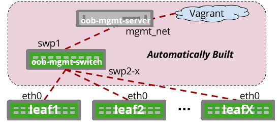

# Automated Management Network Builder

## Table of Contents
* [Writing a Topology.dot File](#writing-a-topologydot-file)
* [Default Automatic Behaviors](#default-automatic-behaviors)
* [Implementation Details](#implementation-details)
* [Sample Output](#sample-output)


The '-c' option can be used and TC will automatically build a management network for your topology complete with an Out of Band Managment Server (oob-mgmt-server) an Out of Band management switch (oob-mgmt-switch) and every other device's eth0 port connected to a single bridge on the oob-mgmt-switch device. Port swp1 on the oob-mgmt-switch will always connect to the oob-mgmt-server.




### Writing a Topology.dot File
Here is a sample topology.dot file that works with the automated management network builder feature. Notice that mgmt_ip is specified for various nodes, these will be the eth0 ip addresses that will be mapped to DHCP entries on the oob-mgmt-server.

```
graph dc1 {
 "oob-mgmt-server" [function="oob-server" mgmt_ip="192.168.200.254/24"]
 "leaf1" [function="leaf" mgmt_ip="192.168.200.10"]
 "leaf2" [function="leaf" mgmt_ip="192.168.200.20"]
   "leaf1":"swp1" -- "leaf2":"swp1"
   "leaf1":"swp2" -- "leaf2":"swp2"
   "leaf1":"swp3" -- "leaf2":"swp3"
   "leaf1":"swp4" -- "leaf2":"swp4"
}
```

When used with another example topology.dot file like the one below, a default mgmt_ip of 192.168.200.254 will be assumed on the oob-mgmt-server and DHCP will be handed out in a first-come-first-serve fashion from 192.168.200.10-192.168.200.50 in the 192.168.200.0/24 subnet for all eth0 ports on the leaves.

```
graph dc1 {
 "leaf1" [function="leaf"]
 "leaf2" [function="leaf"]
   "leaf1":"swp1" -- "leaf2":"swp1"
   "leaf1":"swp2" -- "leaf2":"swp2"
   "leaf1":"swp3" -- "leaf2":"swp3"
   "leaf1":"swp4" -- "leaf2":"swp4"
}
```

### Default Automatic Behaviors
* OOB-mgmt-server is created using Ubuntu1604
* OOB-mgmt-switch is created using the default CumulusCommunity/cumulus-vx image
  * A link between the oob-mgmt-server:mgmt_net <--> oob-mgmt-switch:swp1 is created
  * A link from Eth0 of each device is created to the next available port on oob-mgmt-switch starting with swp2
* DHCP Server installed on oob-mgmt-server
  * If "mgmt_ip=" is specified on the oob-mgmt-server that IP address will be applied to the eth1 interface. DHCP will be configured for the mgmt_ip subnet based on the CIDR mask that is provided.
    * The first 10-50 hosts of any subnet are reserved as a generic DHCP range.
    * It is recommended to statically assign mgmt_ip addresses for other hosts outside the first 10-50 hosts in the subnet to avoid collisions with the generic DHCP range.
    * It is recommended to have your oob-mgmt-server mgmt_ip configured with .254 as the last octet
  * If "mgmt_ip=" is not specified in the oob-mgmt-server node definition, a default value of 192.168.200.254 is assumed and DHCP will be handled using the 192.168.200.0/24 subnet (192.168.200.10-192.168.200.50).
  * If "mgmt_ip=" is specified in node definitions, a MAC entry will be created for the Eth0 port on each device associated with the provided "mgmt_ip" address for that node. (OOB-Switch will be statically addressed)
* Ansible Installed on oob-mgmt-server
  * Ansible Hostfile prebuilt and installed to /etc/ansible/hosts based on nodes and management IPs
* /etc/hosts file pre-built on oob-mgmt-server


### Implementation Details
In order for the automated management network builder to create all of this extra configuration it uses a series of extra templates which are rendered along with the template which renders the Vagrantfile while Topology Converter is being executed. Those templates exist in the ./templates/auto_mgmt_network/ directory and include:
* ansible_hostfile.j2
* dhcpd.conf.j2
* dhcpd.hosts.j2
* hosts.j2
* OOB_Server_Config_auto_mgmt.sh.j2

These templates, once rendered will be placed on the OOB-mgmt-server in the appropriate locations:
* ansible_hostfile --> /etc/ansible/hosts
* dhcpd.conf --> /etc/dhcpd/dhcpd.conf
* dhcpd.hosts --> /etc/dhcpd/dhcpd.hosts
* hosts --> /etc/hosts
* OOB_Server_Config_auto_mgmt.sh --> executed on bootup

New templates can be added to this directory and they will be automatically rendered to the ./helper_scripts/auto_mgmt_network/ directory however the standard ./templates/Vagrantfile.j2 template would need to be extended to process any new files.

### Sample Output
From the output below it is possible to see the managment links being automatically created. If you use the '-v' option you will see even more as all of the extra individual template files are rendered.

```
python ./topology_converter.py ./examples/2switch_auto_mgmt.dot -c

######################################
          Topology Converter
######################################
           originally written by Eric Pulvino
  adding mgmt links:
    oob-mgmt-switch:swp1 (mac: 44:38:39:00:00:09) --> oob-mgmt-server:eth1 (mac: 44:38:39:00:00:0a)     network_string:net4
    oob-mgmt-switch:swp2 (mac: 44:38:39:00:00:0b) --> leaf1:eth0 (mac: 44:38:39:00:00:0c)     network_string:net7
    oob-mgmt-switch:swp3 (mac: 44:38:39:00:00:0d) --> leaf2:eth0 (mac: 44:38:39:00:00:0e)     network_string:net8
>> DEVICE: oob-mgmt-server
     code: yk0/ubuntu-xenial
     memory: 512
     function: oob-server
     mgmt_ip: 192.168.200.254
     hostname: oob-mgmt-server
     mgmt_cidrmask: /24
     mgmt_dhcp_start: 192.168.200.10
     config: ./helper_scripts/auto_mgmt_network/OOB_Server_Config_auto_mgmt.sh
     mgmt_network: 192.168.200.0
     mgmt_dhcp_stop: 192.168.200.50
     mgmt_netmask: 255.255.255.0
       LINK: eth1
               remote_device: oob-mgmt-switch
               mac: 44:38:39:00:00:0a
               network: net6
               remote_interface: swp1
>> DEVICE: oob-mgmt-switch
     code: CumulusCommunity/cumulus-vx
     memory: 512
     function: oob-switch
     hostname: oob-mgmt-switch
     config: ./helper_scripts/oob_switch_config.sh
       LINK: swp1
               remote_device: oob-mgmt-server
               mac: 44:38:39:00:00:09
               network: net6
               remote_interface: eth1
       LINK: swp2
               remote_device: leaf1
               mac: 44:38:39:00:00:0b
               network: net7
               remote_interface: eth0
       LINK: swp3
               remote_device: leaf2
               mac: 44:38:39:00:00:0d
               network: net8
               remote_interface: eth0
>> DEVICE: leaf1
     code: CumulusCommunity/cumulus-vx
     memory: 512
     function: leaf
     mgmt_ip: 192.168.200.10
     hostname: leaf1
     config: ./helper_scripts/extra_switch_config.sh
       LINK: eth0
               remote_device: oob-mgmt-switch
               mac: 44:38:39:00:00:0c
               network: net7
               remote_interface: swp2
       LINK: swp1
               remote_device: leaf2
               mac: 44:38:39:00:00:07
               network: net4
               remote_interface: swp1
       LINK: swp2
               remote_device: leaf2
               mac: 44:38:39:00:00:01
               network: net1
               remote_interface: swp2
       LINK: swp3
               remote_device: leaf2
               mac: 44:38:39:00:00:05
               network: net3
               remote_interface: swp3
       LINK: swp4
               remote_device: leaf2
               mac: 44:38:39:00:00:03
               network: net2
               remote_interface: swp4
>> DEVICE: leaf2
     code: CumulusCommunity/cumulus-vx
     memory: 512
     function: leaf
     mgmt_ip: 192.168.200.20
     hostname: leaf2
     config: ./helper_scripts/extra_switch_config.sh
       LINK: eth0
               remote_device: oob-mgmt-switch
               mac: 44:38:39:00:00:0e
               network: net8
               remote_interface: swp3
       LINK: swp1
               remote_device: leaf1
               mac: 44:38:39:00:00:08
               network: net4
               remote_interface: swp1
       LINK: swp2
               remote_device: leaf1
               mac: 44:38:39:00:00:02
               network: net1
               remote_interface: swp2
       LINK: swp3
               remote_device: leaf1
               mac: 44:38:39:00:00:06
               network: net3
               remote_interface: swp3
       LINK: swp4
               remote_device: leaf1
               mac: 44:38:39:00:00:04
               network: net2
               remote_interface: swp4

############
SUCCESS: Vagrantfile has been generated!
############

            4 devices under simulation.

DONE!

```

###Customizations

####User defined management connections

Sometimes the user wants to define the OOB connections to better emulate production behaviour. The -c option automatically defines MAC addresses and port ordering. The -cmd option lets the user map the oob connections, but then still leverage topology_converter to create all the DHCP and /etc/hosts mappings.

The -cmd option requires that the oob-mgmt-switch and oob-mgmt-server are defined manually, and explicitly called by these static names.

In the below example, the network oob connections are defined:
 graph vx {
  "leaf01" [function="leaf" os="CumulusCommunity/cumulus-vx" version="3.2.1" memory="512" config="./helper_scripts/config_switch.sh" mgmt_ip="10.128.0.101"]
  "leaf02" [function="leaf" os="CumulusCommunity/cumulus-vx" version="3.2.1" memory="512" config="./helper_scripts/config_switch.sh" mgmt_ip="10.128.0.102"]
  "server01" [function="host" os="yk0/ubuntu-xenial" memory="512" config="./helper_scripts/config_server.sh" mgmt_ip="10.128.0.31"]
  "server02" [function="host" os="yk0/ubuntu-xenial" memory="512" config="./helper_scripts/config_server.sh" mgmt_ip="10.128.0.32"]
  "oob-mgmt-switch" [function="oob-switch" version="3.2.1" config="./helper_scripts/oob_switch_config.sh" mgmt_ip="10.128.0.254"]
  "oob-mgmt-server" [function="oob-server" memory="1024" mgmt_ip="10.128.0.1"]

  "leaf01":"swp51" -- "leaf02":"swp51"
  "leaf01":"swp52" -- "leaf02":"swp52"

  "server01":"eth1" -- "leaf01":"swp1"
  "server01":"eth2" -- "leaf02":"swp1"
  "server02":"eth1" -- "leaf01":"swp2"
  "server02":"eth2" -- "leaf02":"swp2"

  "oob-mgmt-server":"mgmt_net" -- "oob-mgmt-switch":"swp99"
  "server01":"eth0" -- "oob-mgmt-switch":"swp100" [left_mac="A0:00:00:00:00:31"]
  "server02":"eth0" -- "oob-mgmt-switch":"swp101" [left_mac="A0:00:00:00:00:32"]
  "leaf01":"eth0" -- "oob-mgmt-switch":"swp102" [left_mac="00:25:90:b2:27:0b"]
  "leaf02":"eth0" -- "oob-mgmt-switch":"swp103" [left_mac="00:25:90:b2:30:bd"]
  }

####Rebuilding DHCP and /etc/hosts without rebuilding Vagrantfile

When using topology_converter, sometimes the DHCP mac-to-ip mapping information for the oob management network may need to be tweaked. This requires editing the topology.dot file. Since no actual connection information is changed, and only the MAC to IP mapping, the entire Vagrantfile does not need to be recreated.

In this case, issue the -cco option with topology_converter to recreate all the necessary oob files without having to recreate the entire Vagrantfile.
